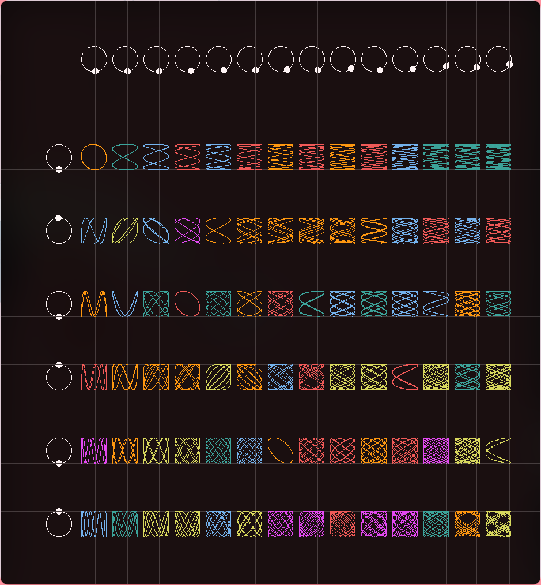

# Lissajous curves table
Made in C++ with libsdl2

## Controlls
- *F1* show/hide control circles
- *F3* show/hide drawing lines

## Compile
1. `mkdir build && cd build`
2. `cmake .. && make`
3. run it! `./Lissajous`
